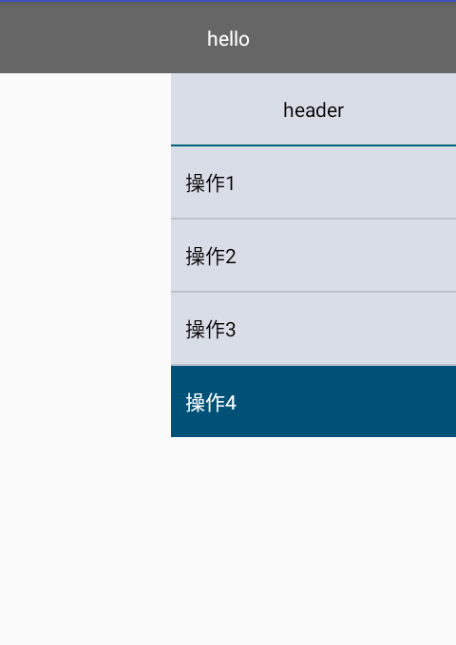
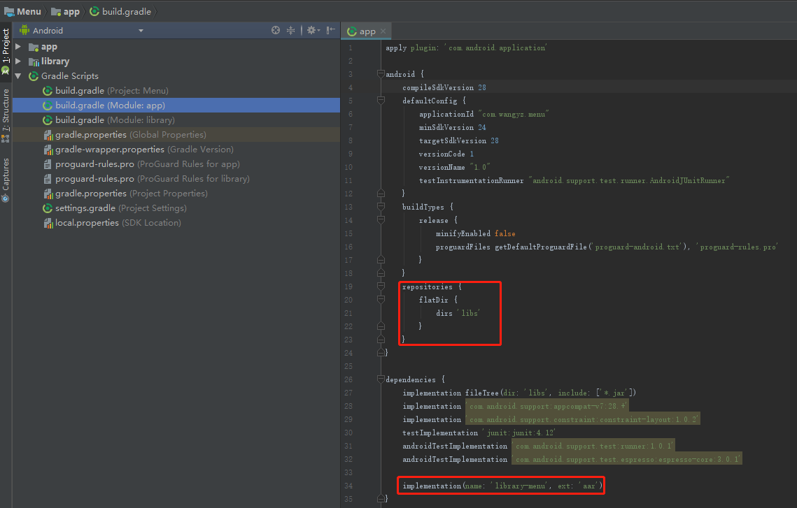
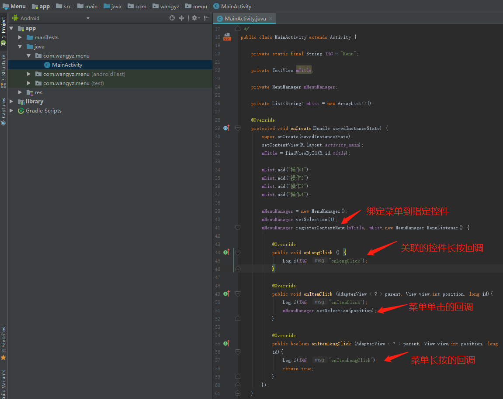
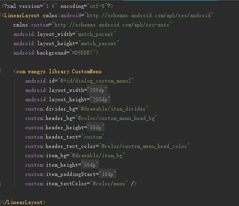

# 简介

> 一个简单的自定义菜单。支持修改布局的颜色，菜单内容，菜单项高度等。

控件预览如下:



简单使用:

在app/libs目录下引入library-menu.aar.修改app的build.gradle文件。如下图中红框所示:



在Activity中使用:



registerContextMenu方法有两个重载，如果不指定加载的资源布局，会默认使用aar中的布局，展示默认的效果。

```java
public void registerContextMenu(View anchor, List<String> list, MenuManager.MenuListener listener)
```

如果自定义布局，则使用以下方法加载：

```java
public void registerContextMenu(View anchor, List<String> list, int layoutId, int menuId, MenuManager.MenuListener listener)
```

对应的xml示例如下:



在ondestory方法中，解注册。

```java
mMenuManager.unregisterContextMenu();
```

自定义属性:

header_text:标题文字内容

header_text_color:标题文字颜色

header_bg:标题区域背景色

header_height:标题区域高度

divider_bg:标题区域和菜单区域分割线背景色

item_bg:菜单项背景色

item_paddingStart:菜单项padding

item_textColor:菜单文字颜色

item_height:菜单项高度